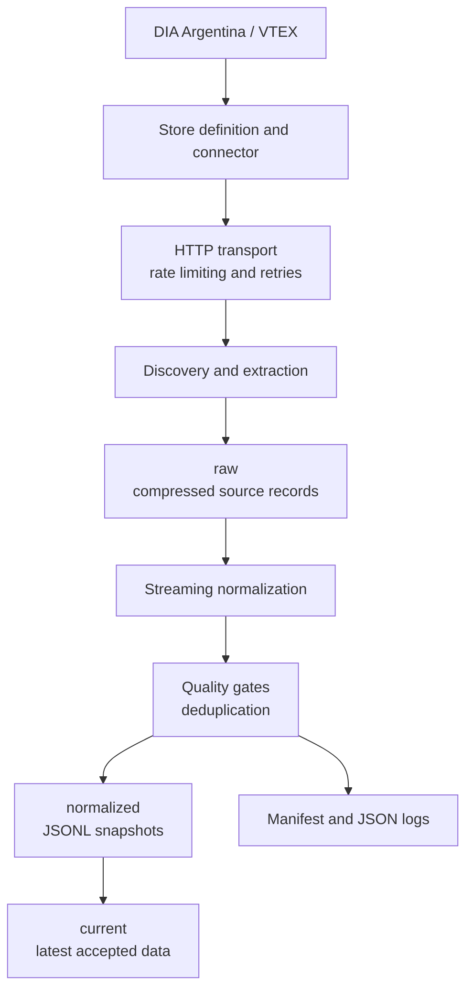

[](https://github.com/lugonesnicolas/ndevscrap/actions/workflows/ci.yml)

# NDevScrap

**Modular retail data acquisition: reproducible Python pipelines that turn public and authorized data into validated, traceable snapshots.**

NDevScrap is a production-oriented foundation for acquiring retail data. It keeps connector contracts, execution, transport, quality gates and storage separate, so a store integration can evolve without turning into a one-off script.

The current implementation acquires the public DIA Argentina catalog through VTEX. When an authorized ClubDIA session is explicitly configured, it also collects the permitted coupon metadata. The repository ships a local CLI, a Docker image, a deterministic test suite, and quality and security workflows on GitHub Actions.

## Capabilities

- Modular store and connector composition with typed public contracts.
- API-first acquisition through VTEX; browser automation is an architectural option, not part of the current DIA flow.
- Raw, normalized and current data layers with provenance and atomic publication.
- Streaming normalization, deduplication and quality gates before publication.
- Bounded retries, rate limiting and structured JSON logs that never include request material.
- Idempotent snapshots, recovery from transient catalog failures and per-component manifests.
- Deterministic pytest fixtures, Ruff checks, Docker execution and CI.
- Spec-Driven Development (SDD), ADRs and a reusable platform catalog.

## Architecture



The [architecture guide](docs/architecture.md) explains the boundaries and trade-offs. The diagram shows the implemented DIA flow; a scheduler, cloud runtimes and browser-based acquisition are not implemented.

## Current implementation: DIA Argentina on VTEX

DIA Argentina is the functional integration today, not a demo. The `dia` store definition composes two independent components:

| Component | Access | Output | Publication |
| --- | --- | --- | --- |
| DIA catalog | Public VTEX Intelligent Search | `products.jsonl` | Critical; published only when quality gates pass. |
| ClubDIA coupons | Authorized operator session | `coupons.jsonl` | Optional and sensitive; raw session responses are never persisted. |

Prices and availability depend on the postal code; the default pilot code is `1806`. ClubDIA requires an explicitly configured authorized session. Without a configured or valid session, the public catalog can still be published and the CLI returns `partial_success` (exit code `2`), keeping the last valid coupon output.

## Quick start

Requires Python 3.12 and [uv](https://docs.astral.sh/uv/).

```bash
uv sync --all-groups
uv run ndevscrap run dia --postal-code 1806 --output output
```

The command writes JSON logs to stderr and one result object to stdout:

```json
{
  "status": "success",
  "run_id": "7b6f0d4a-8098-4a5d-b0a8-13ab4d92f7d1",
  "snapshot": "output/dia/1806/2026-09-27"
}
```

This is a sanitized sample of the shape: `run_id` and paths are generated on every run. Exit codes are `0` for `success`, `2` for `partial_success` and `1` for configuration, storage or execution errors. The [operations guide](docs/operations.md) (in Spanish) covers configuration, output layout, sessions, exit codes and Docker.

## Output and execution evidence

The normalized catalog uses versioned JSONL records. The following sanitized row is an abridged illustration of the public `ProductSnapshot` contract:

```json
{
  "product_id": "1000",
  "sku_id": "1000-1",
  "name": "Producto de ejemplo",
  "available": true,
  "selling_price": "1250.00",
  "currency": "ARS",
  "postal_code": "1806",
  "captured_at": "2026-09-27T12:00:00-03:00",
  "source_url": "https://diaonline.supermercadosdia.com.ar/example",
  "schema_version": "1"
}
```

Each run records a versioned manifest with the hash of the effective public configuration and, per component, counts, retries, HTTP status codes, duration and publication outcome. Headers, cookies and tokens never appear in logs, manifests or outputs.

## Engineering decisions

Decision records are written in Spanish.

- [ADR-0001](docs/adr/0001-modular-connectors.md): modular monolith and connector composition.
- [ADR-0002](docs/adr/0002-api-first-browser-isolation.md): API first, static HTML second, browser only when justified.
- [ADR-0003](docs/adr/0003-store-definitions-component-publication.md): store definitions and independent per-component publication.

The DIA/VTEX implementation and its validation evidence live in the [SDD initiatives](docs/sdd/README.md). The [VTEX platform catalog](docs/platforms/vtex/README.md) keeps versioned platform knowledge separate from any single store's configuration.

## Testing and quality

The deterministic suite uses local fixtures and never contacts DIA. It covers VTEX parsing, normalization, transport failures, retries, session handling, quality thresholds, output provenance, idempotent publication and CLI contracts.

```bash
uv sync --all-groups
uv run pytest
uv run ruff check .
uv run ruff format --check .
python scripts/validate_repository.py
python scripts/validate_repository.py --self-test
```

GitHub Actions runs tests, Ruff and documentation/SDD validation on pushes and pull requests. The repository also uses CodeQL, dependency review and Dependabot.

## Project structure

```text
src/ndevscrap/    CLI, contracts, transport, storage and connectors
tests/            deterministic pytest suite and sanitized fixtures
docs/             architecture, ADRs, operations and SDD evidence
scripts/          repository validation and authorized session extraction
output/           generated local results, ignored by Git
```

## Documentation

Most in-depth documents are written in Spanish.

- [Architecture](docs/architecture.md)
- [Operations and Docker](docs/operations.md)
- [Architecture Decision Records](docs/adr/README.md)
- [SDD workflow and initiatives](docs/sdd/README.md)
- [Platform catalog](docs/platforms/README.md)
- [Contributing](CONTRIBUTING.md)

## Responsible data acquisition

Use only public or explicitly authorized access. Configure conservative limits, review the applicable terms and `robots.txt`, and keep sessions out of version control. NDevScrap does not bypass authentication or anti-abuse controls. The [operations guide](docs/operations.md) describes the session and transport security model.

## License

Released under the [MIT License](LICENSE).
