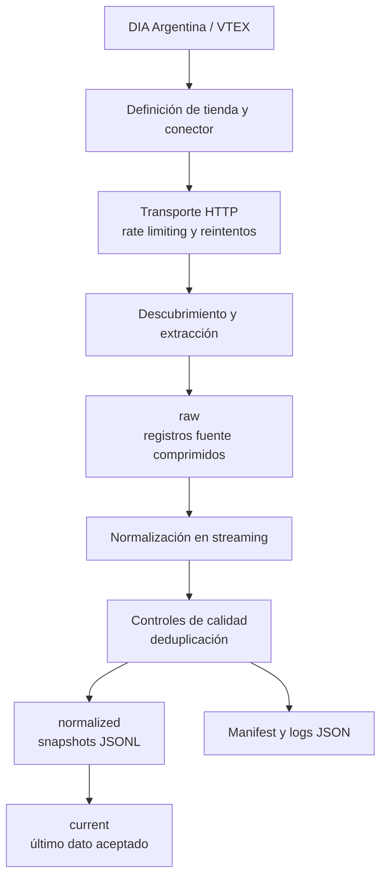

# NDevScrap

**Adquisición modular de datos para retail: pipelines Python reproducibles que transforman datos públicos y autorizados en snapshots validados y trazables.**

NDevScrap es una base orientada a operación para adquirir datos de retail. Separa contratos de conectores, ejecución, transporte, controles de calidad y almacenamiento para que una integración de tienda pueda evolucionar sin convertirse en un script aislado.

La implementación actual adquiere el catálogo público de DIA Argentina mediante VTEX. Cuando se configura explícitamente una sesión autorizada de ClubDIA, también recolecta metadata de cupones permitida. El repositorio incluye CLI local, imagen Docker, pruebas deterministas y workflows de calidad y seguridad en GitHub Actions.

## Capacidades

- Composición modular de tiendas y conectores con contratos públicos tipados.
- Adquisición API-first mediante VTEX; automatización de navegador es una alternativa arquitectónica, no parte del flujo DIA actual.
- Capas raw, normalized y current con procedencia y publicación atómica.
- Normalización en streaming, deduplicación y controles de calidad antes de publicar.
- Reintentos acotados, rate limiting y logs JSON estructurados sin material de requests.
- Snapshots idempotentes, reanudación de fallos transitorios del catálogo y manifests por componente.
- Fixtures deterministas de pytest, controles Ruff, ejecución Docker y CI.
- Spec-Driven Development (SDD), ADRs y catálogo reutilizable de plataformas.

## Arquitectura



La [guía de arquitectura](docs/architecture.md) explica los límites y trade-offs. Este diagrama representa el flujo DIA implementado; scheduler, runtimes cloud y adquisición con navegador no están implementados.

## Implementación actual: DIA Argentina sobre VTEX

La definición de tienda `dia` compone dos componentes independientes:

| Componente | Acceso | Salida | Publicación |
| --- | --- | --- | --- |
| Catálogo DIA | VTEX Intelligent Search público | `products.jsonl` | Crítico; publica sólo cuando pasa controles de calidad. |
| Cupones ClubDIA | Sesión autorizada del operador | `coupons.jsonl` | Opcional y sensible; nunca persiste respuestas raw de sesión. |

Los precios y la disponibilidad se contextualizan por código postal. El código piloto predeterminado es `1806`. Sin una sesión ClubDIA configurada o válida, el catálogo público puede publicarse y la CLI devuelve `partial_success` (código `2`), conservando la última salida de cupones válida.

## Inicio rápido

Requiere Python 3.12 y [uv](https://docs.astral.sh/uv/).

```bash
uv sync --all-groups
uv run ndevscrap run dia --postal-code 1806 --output output
```

El comando escribe logs JSON por stderr y un objeto de resultado por stdout:

```json
{
  "status": "success",
  "run_id": "7b6f0d4a-8098-4a5d-b0a8-13ab4d92f7d1",
  "snapshot": "output/dia/1806/2026-09-27"
}
```

Es una muestra sanitizada de forma: `run_id` y las rutas se generan en cada ejecución. La [guía de operación](docs/operations.md) cubre configuración, layout de salida, sesiones, códigos de salida y Docker.

## Salida y evidencia de ejecución

El catálogo normalizado usa registros JSONL versionados. Una fila representativa y sanitizada corresponde al contrato público `ProductSnapshot`:

```json
{
  "product_id": "1000",
  "sku_id": "1000-1",
  "name": "Producto de ejemplo",
  "available": true,
  "selling_price": "1250.00",
  "currency": "ARS",
  "postal_code": "1806",
  "captured_at": "2026-09-27T12:00:00-03:00",
  "source_url": "https://diaonline.supermercadosdia.com.ar/example",
  "schema_version": "1"
}
```

Cada corrida registra un manifest versionado con hash de configuración pública efectiva y conteos, reintentos, códigos HTTP, duración y resultado de publicación por componente. Headers, cookies y tokens no aparecen en logs, manifests ni outputs.

## Decisiones de ingeniería

- [ADR-0001](docs/adr/0001-modular-connectors.md): monolito modular y composición de conectores.
- [ADR-0002](docs/adr/0002-api-first-browser-isolation.md): API primero, HTML estático después y navegador sólo cuando se justifica.
- [ADR-0003](docs/adr/0003-store-definitions-component-publication.md): definiciones de tienda y publicación independiente por componente.

La implementación DIA/VTEX y su evidencia de validación viven en las [iniciativas SDD](docs/sdd/README.md). El [catálogo de VTEX](docs/platforms/vtex/README.md) mantiene conocimiento versionado de la plataforma separado de la configuración de una tienda.

## Pruebas y calidad

La suite determinista usa fixtures locales; no contacta DIA. Cubre parsing VTEX, normalización, fallos de transporte, reintentos, manejo de sesión, umbrales de calidad, procedencia de outputs, publicación idempotente y contratos de CLI.

```bash
uv sync --all-groups
uv run pytest
uv run ruff check .
uv run ruff format --check .
python scripts/validate_repository.py
python scripts/validate_repository.py --self-test
```

GitHub Actions ejecuta pruebas, Ruff y validación documental/SDD en pushes y pull requests. También incluye CodeQL, dependency review y Dependabot.

## Estructura del proyecto

```text
src/ndevscrap/    CLI, contratos, transporte, almacenamiento y conectores
tests/            suite pytest determinista y fixtures sanitizadas
docs/             arquitectura, ADRs, operación y evidencia SDD
scripts/          validación del repositorio y extracción de sesión autorizada
output/           resultados locales generados, ignorados por Git
```

## Documentación

- [Arquitectura](docs/architecture.md)
- [Operación y Docker](docs/operations.md)
- [Architecture Decision Records](docs/adr/README.md)
- [Flujo e iniciativas SDD](docs/sdd/README.md)
- [Catálogo de plataformas](docs/platforms/README.md)
- [Contribuir](CONTRIBUTING.md)

## Adquisición responsable de datos

Use sólo accesos públicos o autorizados explícitamente. Configure límites conservadores, revise los términos aplicables y `robots.txt`, y mantenga las sesiones fuera de control de versiones. NDevScrap no elude autenticación ni controles antiabuso. La [guía de operación](docs/operations.md) describe el modelo de seguridad de sesión y transporte.

## Licencia

Publicado bajo la [licencia MIT](LICENSE).
